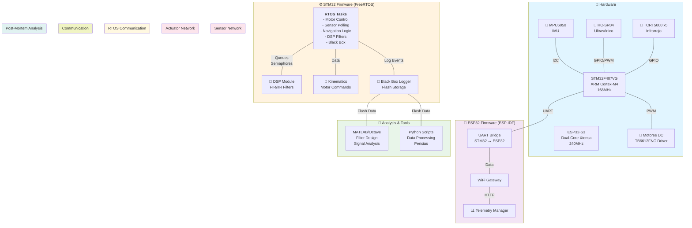
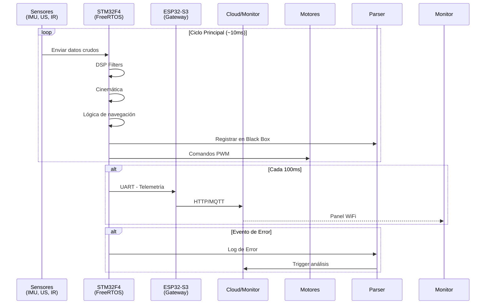
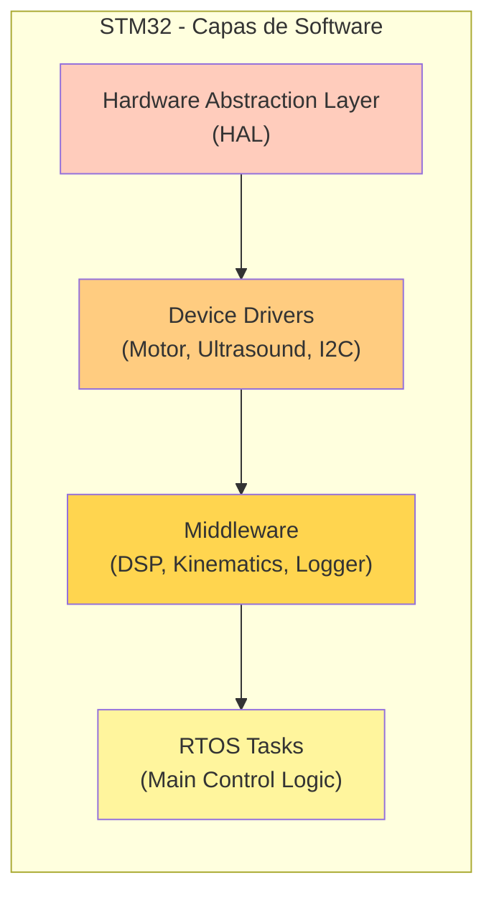
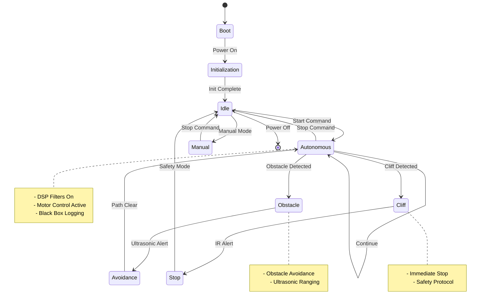
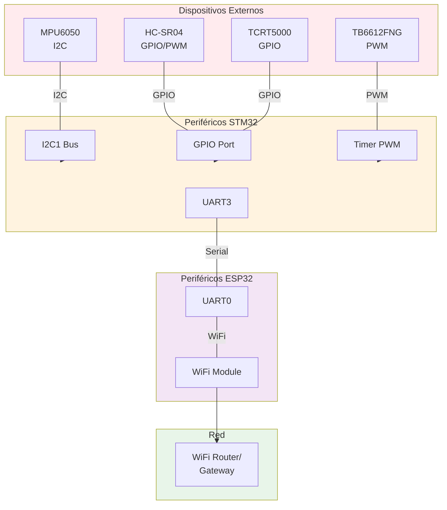
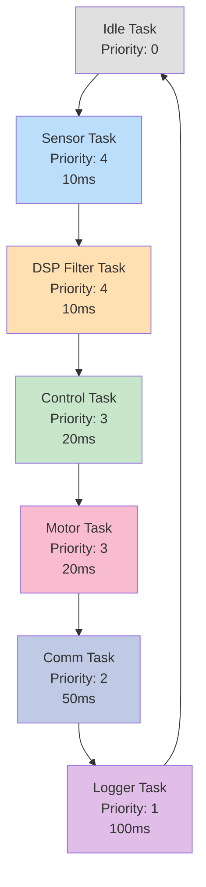
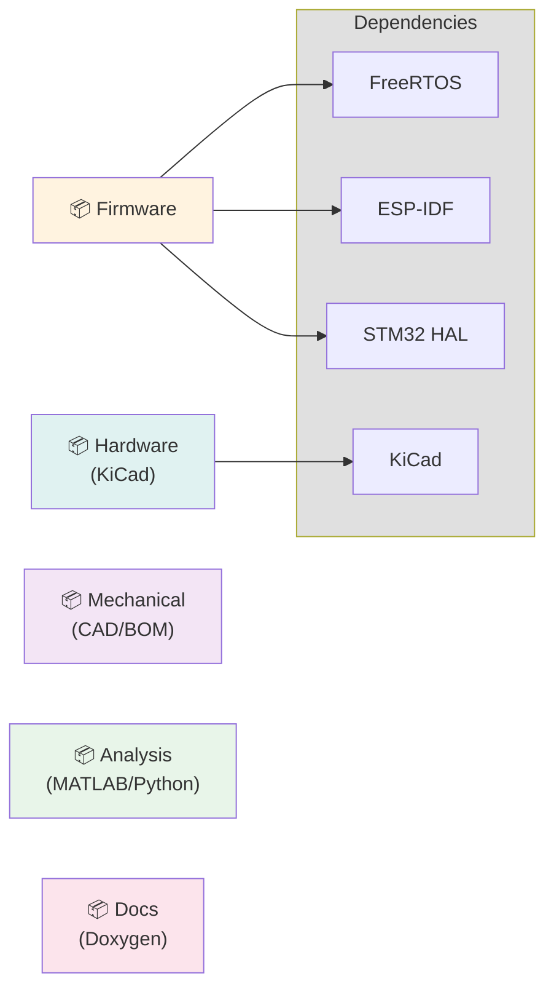

# Arquitectura de GenericAutonomousRobot (GAR)

## Diagrama de Arquitectura General

---

## Diagrama de Flujo de Datos

---

## Diagrama de Capas del Software

---

## Diagrama de Estados del Sistema

---

## Diagrama de Interfaces de Comunicación

---

## Diagrama de Tareas RTOS (STM32)

---

## Diagrama de Módulos del Proyecto

---

**Fecha de creación**: 8 de marzo de 2026
